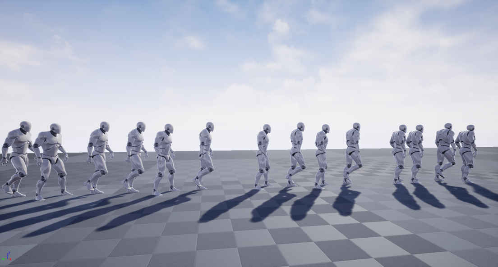

# gsm cafeteria

코로나로 인해 급식실 내부에 있을 수 있는 인원이 줄어들어서, 타이밍을 잘못 잡으면 대기 시간이 길어졌다.  

내부에 앉을 수 있는 인원을 파악하고 채팅 봇을 이용해 알려준다.  

## Architecture
  

## 문제 파악 과정

급식을 먹기 위해 대기하는 줄  
  

부족한 식탁 개수
  

부족한 식탁으로 인해 급식판을 들고 대기하는 사람  
  

개선방안  
각 반에서 급식실의 상황을 실시간으로 볼 수 있게 한다.  

## References
[pleople-counter](https://github.com/hrnr/people-counter)
