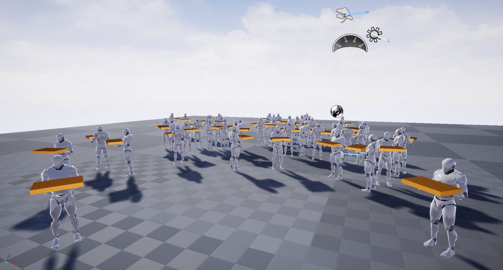

gsm cafeteria

급식실 몰림현상 방지 프로젝트  

현재 문제점  
급식을 먹기 위해 대기하는 줄  
  

부족한 식탁 개수
  

부족한 식탁으로 인해 급식판을 들고 대기하는 사람  
  

개선방안  
각 반에서 급식실의 상황을 실시간으로 볼 수 있게 한다.  

[pleople-counter](https://github.com/hrnr/people-counter)